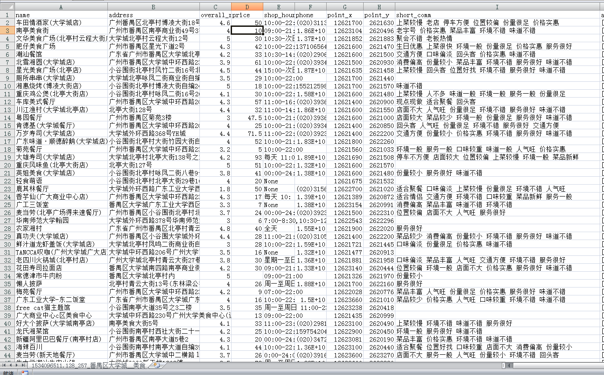
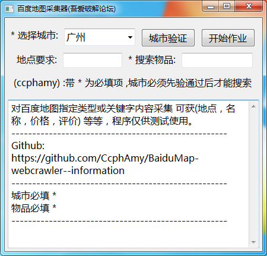

# 百度地图信息采集器v1.0
对百度地图指定类型或关键字内容采集 可获(地点，名称，价格，评价) 等等，仅供测试用

## 更新：
* 20180813 上传项目

## 要求（py脚本）
* python3+requests+wxpython+BeautifulSoup4+lxml+Pypubsub

## 文件结构：
```bash

├── README.md
│
├── dist
│   └── getBaiduMap.exe
│
├── GUI
│   └── window.fbp
│
├── images
│   ├── main.png
│   ├── scv1.png
│   └── scv2.png
│
├── src
│   ├── frame.py
│   └── getBaiduMap.py
```


## 使用方法
* 可从dist文件中直接下载getBaiduMap.getBaiduMap.py
### 美食~

### 酒店~

### 主界面

